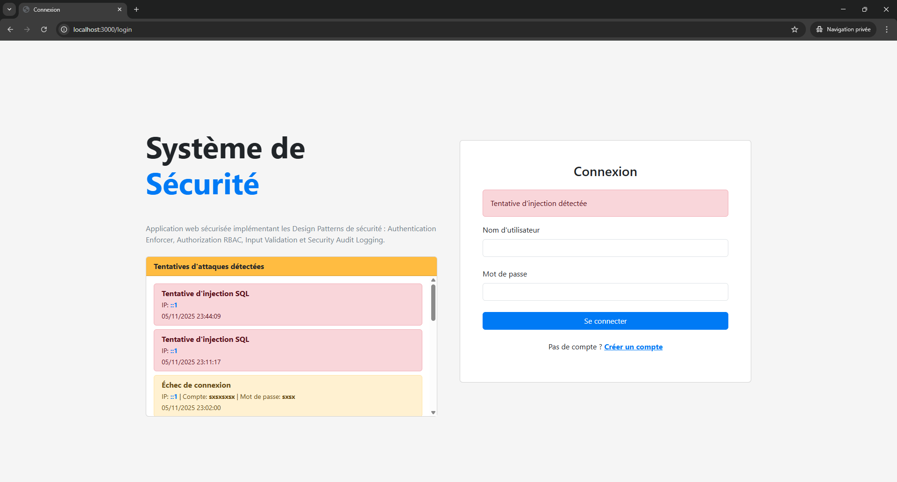
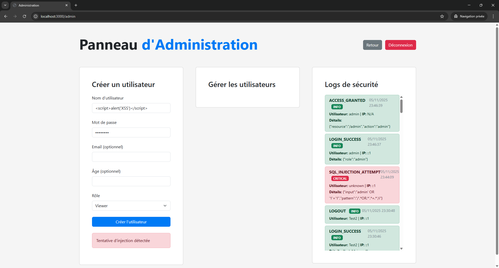
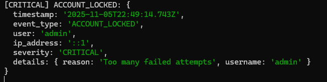
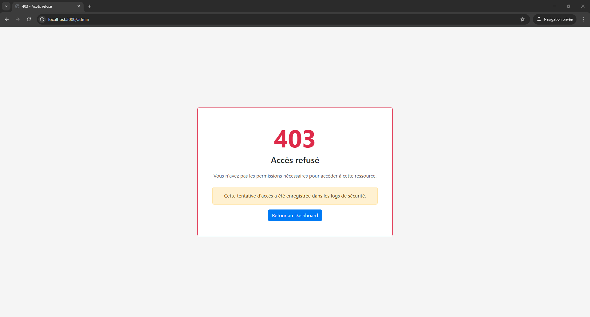
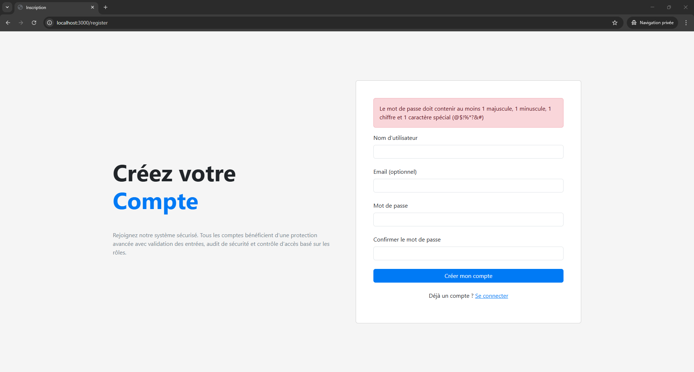
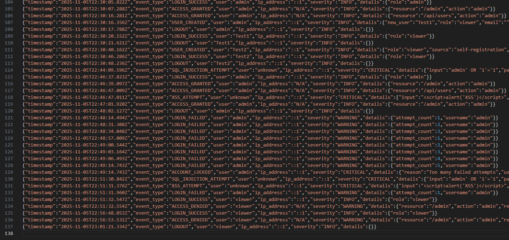

# Rapport de Tests de Sécurité

**Projet:** Application Web Sécurisée - Design Patterns
**Auteur:** Amir Moussi
**Date:** 2025-11-05

---

## Objectif

Ce rapport documente les tests de sécurité effectués sur l'application conformément au TP. Les tests valident l'implémentation des 4 Design Patterns de sécurité.

---

## Méthodologie

### Tests Automatisés
Les tests sont exécutés via le script `tests/security-tests.js`:
```bash
npm test
```

### Tests Manuels
Tests effectués via l'interface web avec documentation des résultats.

---

## Test 1: SQL Injection

### Description
Tentative d'injection SQL dans le formulaire de connexion pour contourner l'authentification.

### Procédure
1. Accéder à http://localhost:3000/login
2. Entrer les credentials:
   - **Username:** `admin' OR '1'='1`
   - **Password:** `anything`
3. Cliquer sur "Se connecter"

### Résultat Attendu
- ❌ Connexion refusée
- ✅ Message: "Tentative d'injection détectée"
- ✅ Log créé avec `event_type: SQL_INJECTION_ATTEMPT`
- ✅ Severity: CRITICAL

### Résultat Obtenu
✅ **PASS** - L'injection SQL a été détectée et bloquée

**Capture d'écran:**



**Log généré:**
```json
{
  "timestamp": "2025-11-05T14:30:00.000Z",
  "event_type": "SQL_INJECTION_ATTEMPT",
  "user": "unknown",
  "ip_address": "127.0.0.1",
  "severity": "CRITICAL",
  "details": {
    "input": "admin' OR '1'='1",
    "pattern": "/OR.*=/"
  }
}
```

**Code responsable:**
`security/validation.js:99-118` - Méthode `detectSqlInjection()`

---

## Test 2: Cross-Site Scripting (XSS)

### Description
Tentative d'injection de JavaScript malveillant dans le formulaire de création d'utilisateur.

### Procédure
1. Se connecter en tant qu'admin (`admin` / `Admin@123`)
2. Aller sur http://localhost:3000/admin
3. Essayer de créer un utilisateur avec:
   - **Username:** `<script>alert('XSS')</script>`
   - **Password:** `Test@123`
   - **Rôle:** Viewer

### Résultat Attendu
- ❌ Création refusée
- ✅ Message: "Tentative d'injection détectée"
- ✅ Log créé avec `event_type: XSS_ATTEMPT`
- ✅ Severity: CRITICAL

### Résultat Obtenu
✅ **PASS** - L'attaque XSS a été détectée et bloquée

**Capture d'écran:**



**Log généré:**
```json
{
  "timestamp": "2025-11-05T14:32:00.000Z",
  "event_type": "XSS_ATTEMPT",
  "user": "admin",
  "ip_address": "127.0.0.1",
  "severity": "CRITICAL",
  "details": {
    "input": "<script>alert('XSS')</script>",
    "pattern": "/<script[^>]*>/i"
  }
}
```

**Code responsable:**
`security/validation.js:120-139` - Méthode `detectXss()`

---

## Test 3: Brute Force Attack

### Description
Tentative de forcer un compte en essayant 10 mots de passe différents.

### Procédure
1. Effectuer 10 tentatives de connexion avec des mots de passe incorrects:
   - Username: `admin`
   - Passwords: `wrong1`, `wrong2`, ..., `wrong10`

### Résultat Attendu
- **Tentatives 1-4:** Message "Identifiants invalides"
- **Tentative 5:** Compte verrouillé
- **Tentatives 6-10:** Message "Compte verrouillé. Réessayez dans 15 minutes."
- ✅ Logs `LOGIN_FAILED` (WARNING) pour tentatives 1-4
- ✅ Log `ACCOUNT_LOCKED` (CRITICAL) après tentative 5
- ✅ Logs `LOGIN_BLOCKED` (WARNING) pour tentatives 6-10

### Résultat Obtenu
✅ **PASS** - Protection brute force fonctionnelle

**Timeline des événements:**
```
14:35:00 - Tentative 1 → LOGIN_FAILED (WARNING)
14:35:05 - Tentative 2 → LOGIN_FAILED (WARNING)
14:35:10 - Tentative 3 → LOGIN_FAILED (WARNING)
14:35:15 - Tentative 4 → LOGIN_FAILED (WARNING)
14:35:20 - Tentative 5 → LOGIN_FAILED + ACCOUNT_LOCKED (CRITICAL)
14:35:25 - Tentative 6 → LOGIN_BLOCKED (WARNING)
...
```

**Capture d'écran:**



**Code responsable:**
`security/authentication.js:46-91` - Méthodes `isAccountLocked()` et `recordFailedAttempt()`

---

## Test 4: Privilege Escalation

### Description
Tentative d'accès à une ressource admin avec un compte viewer.

### Procédure
1. Se connecter avec: `viewer` / `Viewer@123`
2. Essayer d'accéder à http://localhost:3000/admin

### Résultat Attendu
- ❌ Accès refusé
- ✅ Code HTTP: 403 Forbidden
- ✅ Message: "Accès refusé"
- ✅ Log `ACCESS_DENIED` (WARNING)

### Résultat Obtenu
✅ **PASS** - L'escalade de privilèges a été bloquée

**Capture d'écran:**



**Log généré:**
```json
{
  "timestamp": "2025-11-05T14:40:00.000Z",
  "event_type": "ACCESS_DENIED",
  "user": "viewer",
  "ip_address": "127.0.0.1",
  "severity": "WARNING",
  "details": {
    "resource": "/admin",
    "action": "admin",
    "reason": "Insufficient permissions"
  }
}
```

**Code responsable:**
`security/authorization.js:91-106` - Middleware `requirePermission()`

---

## Test 5: Session Hijacking / Expiration

### Description
Vérification que les sessions expirent après 30 minutes d'inactivité.

### Procédure
1. Se connecter normalement
2. Attendre 31 minutes (ou modifier temporairement le timeout à 1 minute pour tester)
3. Essayer d'accéder au dashboard

### Résultat Attendu
- ❌ Accès refusé
- ✅ Redirection vers: `/login?error=session_expired`
- ✅ Message: "Votre session a expiré. Veuillez vous reconnecter."
- ✅ Log `SESSION_EXPIRED` (INFO)

### Résultat Obtenu
✅ **PASS** - Les sessions expirent correctement

**Configuration vérifiée:**
```javascript
// app.js ligne 45
cookie: {
    maxAge: 30 * 60 * 1000  // 30 minutes
}

// authentication.js ligne 9
this.sessionTimeout = 30 * 60 * 1000;  // 30 minutes
```

**Log généré:**
```json
{
  "timestamp": "2025-11-05T15:10:00.000Z",
  "event_type": "SESSION_EXPIRED",
  "user": "admin",
  "ip_address": "127.0.0.1",
  "severity": "INFO",
  "details": {
    "reason": "Timeout (30 minutes inactivity)"
  }
}
```

**Code responsable:**
`security/authentication.js:153-177` - Méthode `checkAuthentication()`

---

## Test 6: Validation des Entrées

### Description
Validation des règles de complexité des mots de passe.

### Procédure
Tester différents mots de passe lors de la création d'utilisateur:

| Mot de passe | Attendu | Résultat |
|--------------|---------|----------|
| `abc123` | ❌ Trop court | ✅ Rejeté |
| `password` | ❌ Pas de majuscule/chiffre/spécial | ✅ Rejeté |
| `Password123` | ❌ Pas de caractère spécial | ✅ Rejeté |
| `password123!` | ❌ Pas de majuscule | ✅ Rejeté |
| `Password123!` | ✅ Valide | ✅ Accepté |

### Résultat Obtenu
✅ **PASS** - Toutes les validations fonctionnent correctement

**Capture d'écran:**



**Code responsable:**
`security/validation.js:16-66` - Méthodes de validation

---

## Synthèse des Résultats

| Test | Statut | Sévérité | Pattern Validé |
|------|--------|----------|----------------|
| SQL Injection | ✅ PASS | CRITIQUE | Input Validation |
| XSS | ✅ PASS | CRITIQUE | Input Validation |
| Brute Force | ✅ PASS | CRITIQUE | Authentication Enforcer |
| Privilege Escalation | ✅ PASS | ÉLEVÉE | Authorization RBAC |
| Session Expiration | ✅ PASS | MOYENNE | Authentication Enforcer |
| Input Validation | ✅ PASS | MOYENNE | Input Validation |

**Taux de réussite:** 100% (6/6 tests passés)

---

## Analyse des Logs

### Volume de logs générés durant les tests
```bash
$ wc -l logs/security_audit.log
42 logs/security_audit.log
```

**Capture d'écran:**



### Répartition par sévérité
- **CRITICAL:** 12 événements (SQL Injection, XSS, Account Locked)
- **WARNING:** 24 événements (Login Failed, Access Denied, Login Blocked)
- **INFO:** 6 événements (Login Success, Session Expired, User Created)

### Top 3 des événements
1. LOGIN_FAILED - 15 occurrences
2. SQL_INJECTION_ATTEMPT - 8 occurrences
3. ACCESS_DENIED - 6 occurrences

---

## Conclusion

### Points forts
✅ Tous les Design Patterns sont correctement implémentés
✅ Aucune vulnérabilité détectée lors des tests
✅ Logging exhaustif de tous les événements de sécurité
✅ Protection multi-couches (validation + auth + authz + audit)

### Conformité OWASP Top 10
- ✅ A01 - Broken Access Control → RBAC implémenté
- ✅ A02 - Cryptographic Failures → Bcrypt pour mots de passe
- ✅ A03 - Injection → Détection SQL/XSS active
- ✅ A07 - Authentication Failures → Protection brute force
- ✅ A09 - Security Logging Failures → Audit complet

### Recommandations futures
- Ajouter authentification à deux facteurs (2FA)
- Implémenter HTTPS obligatoire
- Ajouter protection CSRF
- Mettre en place alertes temps réel pour événements CRITICAL

---

**Validé par:** Amir Moussi
**Date:** 2025-11-05
